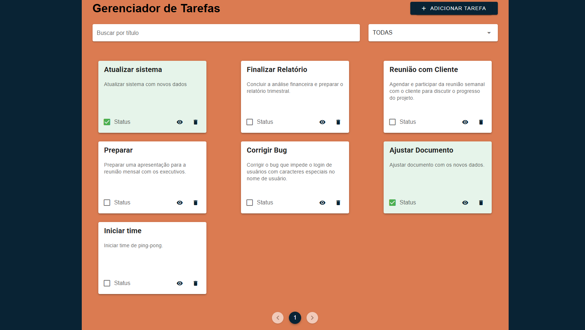
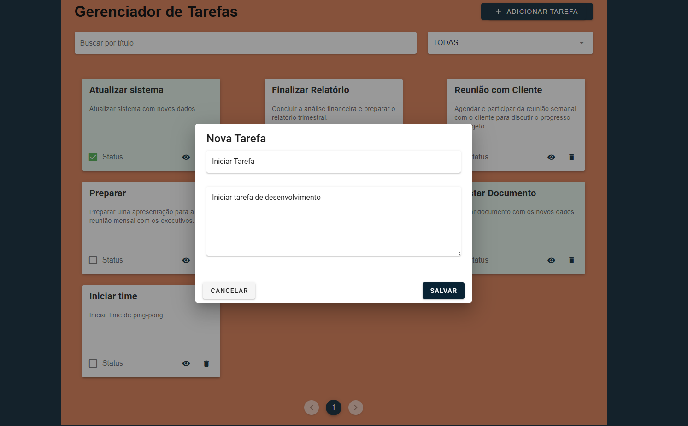

# 🧱 Monolito Full Stack - Vue 2 + Spring Boot (Java 11)

Este projeto é um sistema monolítico composto por:

- **Frontend**: desenvolvido em Vue 2, utilizando Vuex e Vue Router.
- **Backend**: construído com Spring Boot usando Java 11 e acesso a banco de dados PostgreSQL.
- **Banco de dados**: PostgreSQL 16 montado no docker.
- **Containerização**: toda a stack roda via Docker Compose.

---

## 📁 Estrutura do Projeto

```
monorepo-teste-az/
│
├── backend/         # Código fonte do backend (Java 11 - Spring Boot)
│   └── build.gradle
│
├── frontend/        # Código fonte do frontend (Vue 2 + Vuetify)
│   └── package.json
│
├── docker-compose.yml
└── README.md
```

## 🐳 Como rodar com Docker

### 1. Build e execução

No diretório raiz do projeto, execute:

```bash
docker-compose up --build
```

### 2. Acessos

- **Frontend**: http://localhost:8081
- **Backend (API REST)**: http://localhost:8080
- **PostgreSQL**: porta `2222`, database `banco`, usuário `postgres`, senha `123`

---

## 🛠️ Desenvolvimento local

### Backend

#### Requisitos

- Java 11
- Gradle

#### Rodar localmente

```bash
cd backend
./gradlew bootRun
```

---

### Frontend

#### Requisitos

- Node.js >= 14
- Vue CLI

#### Instalação e execução

```bash
cd frontend
npm install
npm run serve
```

---

## ⚙️ Configurações importantes

### Backend - `application.properties` ou variáveis de ambiente

As configurações sensíveis são injetadas por variáveis de ambiente no Docker:

```properties
SPRING_DATASOURCE_URL=jdbc:postgresql://postgres:5432/banco
SPRING_DATASOURCE_USERNAME=postgres
SPRING_DATASOURCE_PASSWORD=123
```

---

## 📗 Swagger

Projeto documentado com o swagger

### 1. Acesso

- **Frontend**: http://localhost:8080/swagger-ui/index.html#/

---

## 🧪 Testes

- **Backend**: utiliza JUnit para testes unitários.

#### Comando para rodar os testes:

```bash
./gradlew test
```

- **Front**: utiliza o Jest para fazer testes simples.

#### Comando para rodar os testes:

```bash
npm run test:unit
```

## 📺 Tela Principal



## 📺 Modal de cadastro


